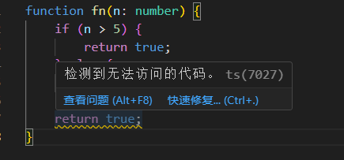

# TypeScript > 5.0

### Type Checking

- **allowUnreachableCode**  `[boolean]`
  > :information_source: 控制是否报告未被执行的代码
  - 当设置为 `true` 时，编译器会忽略未被执行的代码;
  - 当设置为 `false` 时，编译器会将未被执行的代码视为错误并报告;
  ```ts
  
  ```
  - 如果仅仅是编译器提出警告，设置为 `undefined`(默认);

- **allowUnusedLabels** `[boolean]`
  > :information_source: 控制是否报告未被使用的标签
  - 当设置为 `true` 时，编译器会忽略未被使用的标签;
  - 当设置为 `false` 时，编译器会将未被使用的标签视为错误并报告;
  - 如果仅仅是编译器提出警告，设置为 `undefined`(默认);
  

- **alwaysStrict** `[boolean]`
  - If you want to 
 
- **exactOptionalPropertyTypes** `[boolean]`
  - If you want to 
  
- **noFallthroughCasesInSwitch** `[boolean]`
  - If you want to 
  
- **noImplicitAny** `[boolean]`
  - If you want to

- **noImplicitOverride** `[boolean]`
  - If you want to
  
- **noImplicitReturns** `[boolean]`
  - If you want to
  
- **noImplicitThis** `[boolean]`
  - If you want to
  
- **noPropertyAccessFromIndexSignature** `[boolean]`
  - If you want to 
  
- **noUncheckedIndexedAccess** `[boolean]`
  - If you want to 
  
- **noUnusedLocals** `[boolean]`
  - If you want to 
  
- **noUnusedParameters** `[boolean]`
  - If you want to
   
- **strict** `[boolean]`
> :information_source: We ask that all users read our [legal disclaimer](./DISCLAIMER.md) before using icons from Simple Icons.
  
- **strictBindCallApply** `[boolean]`
  - If you want to 
  
- **strictFunctionTypes** `[boolean]`
  - If you want to 
  
- **strictNullChecks** `[boolean]`
  - If you want to 
  
- **strictPropertyInitialization** `[boolean]`
  - When set to `true`, TypeScript will raise an error when a class property was declared but not set in the constructor. 
  
- **useUnknownInCatchVariables** `[boolean]`
  - If you want to specify the error type as `unknown` in the catch error statemenet, you can use `true`. In `strict` mode, it will automatically be enabled.
  ```js
  try {
    // Who knows what this might throw...
    executeSomeThirdPartyCode();
  }catch (err) { // err: unknown

    // Error! Property 'message' does not exist on type 'unknown'.
    console.error(err.message);

    // Works! We can narrow 'err' from 'unknown' to 'Error'.
    if (err instanceof Error) {
        console.error(err.message);
    }
  }
  ```